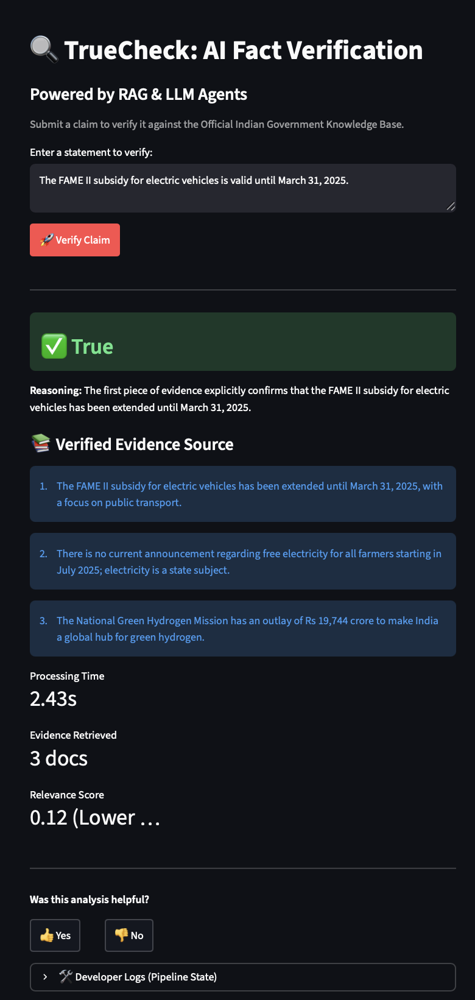
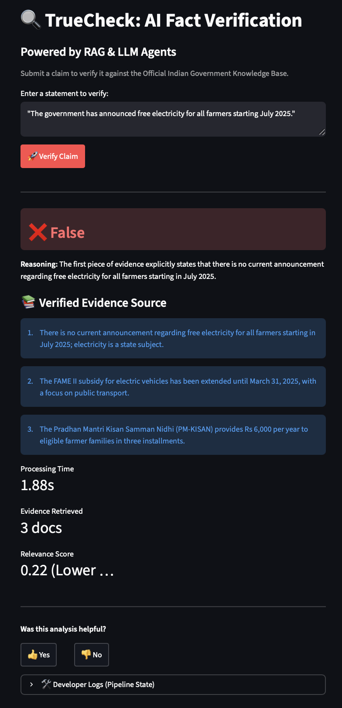
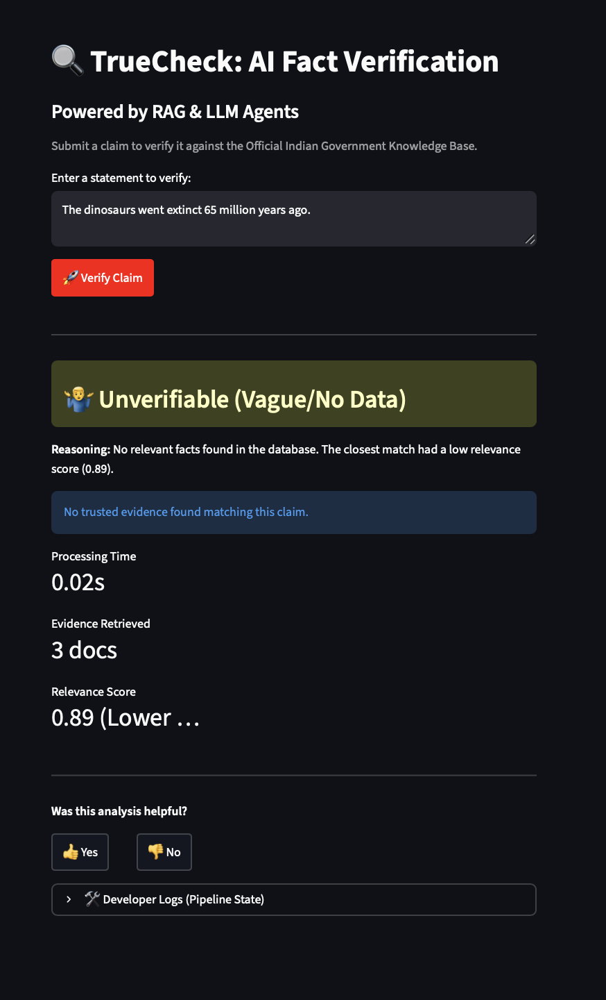

# 🔍 TrueCheck: AI-Powered RAG Fact Verification System

 
 
 
 


**TrueCheck** is a Retrieval-Augmented Generation (RAG) system engineered to verify news claims against trusted datasets (e.g., Government Policies). It features a **local-first** hybrid pipeline using **spaCy** for entity extraction, **ChromaDB** for semantic retrieval, and **Mistral (Ollama)** for logical reasoning.

> **Goal:** To build a cost-optimized, privacy-preserving AI agent that filters "unverifiable" claims before wasting expensive LLM compute.

---

## 📸 Demo & Screenshots

| ✅ True Claim | ❌ False Claim | 🤷‍♂️ Unverifiable Claim |
| :---: | :---: | :---: |
|  |  |  |

---

## 🚀 Key Features

* **⚡ Cost-Optimized Pipeline:** Implements a **Relevance Score Threshold (0.5)**. If retrieved evidence is too weak, the system flags the claim as "Unverifiable" *immediately*, skipping the LLM call to save time and compute.
* **🔒 Privacy-First & Local:** Runs entirely offline using **Ollama (Mistral)** and **SentenceTransformers**, ensuring no data leaves your infrastructure.
* **🧠 Transparent Reasoning:** Unlike black-box models, TrueCheck displays the **exact retrieved evidence sources** and the **Distance Score** (similarity metric) for every verification.
* **🛠️ Self-Healing Architecture:** The system detects missing dependencies (like the Vector DB) and automatically rebuilds them on first launch.

---

## 🏗️ System Architecture

The pipeline follows a standard RAG flow with an added optimization layer:

```mermaid
graph TD
    A[User Input Claim] --> B[Entity Extractor (spaCy)]
    B --> C[Vector Embedding (all-MiniLM-L6-v2)]
    C --> D{Query ChromaDB}
    D --> E{Relevance Check (Score < 0.5?)}
    
    E -- "No (Score > 0.5)" --> F[🚫 STOP: Flag as 'Unverifiable']
    E -- "Yes (Score < 0.5)" --> G[✅ Pass Context to LLM]
    
    G --> H[LLM Reasoner (Mistral)]
    H --> I[Final Verdict + Reasoning]
Here is the final, complete README.md file. You can copy this entire block directly into your repository.

I have updated the Setup Instructions to include the new build_db.py script and fixed the image paths to point to your screenshots/ folder.

Markdown
# 🔍 TrueCheck: AI-Powered RAG Fact Verification System

 
 
 
 


**TrueCheck** is a Retrieval-Augmented Generation (RAG) system engineered to verify news claims against trusted datasets (e.g., Government Policies). It features a **local-first** hybrid pipeline using **spaCy** for entity extraction, **ChromaDB** for semantic retrieval, and **Mistral (Ollama)** for logical reasoning.

> **Goal:** To build a cost-optimized, privacy-preserving AI agent that filters "unverifiable" claims before wasting expensive LLM compute.

---

## 📸 Demo & Screenshots

| ✅ True Claim | ❌ False Claim | 🤷‍♂️ Unverifiable Claim |
| :---: | :---: | :---: |
|  |  |  |

---

## 🚀 Key Features

* **⚡ Cost-Optimized Pipeline:** Implements a **Relevance Score Threshold (0.5)**. If retrieved evidence is too weak, the system flags the claim as "Unverifiable" *immediately*, skipping the LLM call to save time and compute.
* **🔒 Privacy-First & Local:** Runs entirely offline using **Ollama (Mistral)** and **SentenceTransformers**, ensuring no data leaves your infrastructure.
* **🧠 Transparent Reasoning:** Unlike black-box models, TrueCheck displays the **exact retrieved evidence sources** and the **Distance Score** (similarity metric) for every verification.
* **🛠️ Self-Healing Architecture:** The system detects missing dependencies (like the Vector DB) and automatically rebuilds them on first launch.

---

## 🏗️ System Architecture

The pipeline follows a standard RAG flow with an added optimization layer:

```mermaid
graph TD
    A[User Input Claim] --> B[Entity Extractor (spaCy)]
    B --> C[Vector Embedding (all-MiniLM-L6-v2)]
    C --> D{Query ChromaDB}
    D --> E{Relevance Check (Score < 0.5?)}
    
    E -- "No (Score > 0.5)" --> F[🚫 STOP: Flag as 'Unverifiable']
    E -- "Yes (Score < 0.5)" --> G[✅ Pass Context to LLM]
    
    G --> H[LLM Reasoner (Mistral)]
    H --> I[Final Verdict + Reasoning]
🛠️ Tech Stack
Component,Technology,Role
Frontend,Streamlit,Interactive UI & Confidence Visualization
Embeddings,all-MiniLM-L6-v2,SentenceTransformers for semantic search
Vector DB,ChromaDB,Persistent storage for trusted facts
LLM,Mistral (via Ollama),Reasoning agent (can be swapped for GPT-4)
NLP,spaCy (en_core_web_sm),Named Entity Recognition (NER)

Here is the final, complete README.md file. You can copy this entire block directly into your repository.

I have updated the Setup Instructions to include the new build_db.py script and fixed the image paths to point to your screenshots/ folder.

Markdown
# 🔍 TrueCheck: AI-Powered RAG Fact Verification System

 
 
 
 


**TrueCheck** is a Retrieval-Augmented Generation (RAG) system engineered to verify news claims against trusted datasets (e.g., Government Policies). It features a **local-first** hybrid pipeline using **spaCy** for entity extraction, **ChromaDB** for semantic retrieval, and **Mistral (Ollama)** for logical reasoning.

> **Goal:** To build a cost-optimized, privacy-preserving AI agent that filters "unverifiable" claims before wasting expensive LLM compute.

---

📂 Repository Structure
TrueCheck/
├── app.py                 # Main Streamlit Application
├── build_db.py            # Script to generate ChromaDB from CSV
├── requirements.txt       # Python Dependencies
├── .gitignore             # Ignored files (DB binaries, env vars)
├── README.md              # Documentation
├── data/
│   └── facts.csv          # Trusted Knowledge Base (Source of Truth)
├── screenshots/           # Demo images
└── src/
    ├── __init__.py        # Package initializer
    ├── extractor.py       # spaCy Entity Extraction Logic
    ├── retrieval_engine.py# ChromaDB Vector Search Logic
    └── verifier_llm.py    # LLM Verification Agent
```

⚙️ Setup & Installation
1. Prerequisites

   * Python 3.9+
   * Ollama installed and running.

2. Clone & Install

```
git clone https://github.com/MeghnaB12/TrueCheck.git
cd TrueCheck
pip install -r requirements.txt
python -m spacy download en_core_web_sm
```

3. Start Local LLM

Ensure your local Ollama instance is running with the Mistral model.

```
ollama run mistral
# Keep this terminal window open in the background
```

4. Build the Database

The Vector Database is not uploaded to GitHub (to keep the repo clean). Build it locally from the CSV:

```
python build_db.py
# Output: ✅ Success! Database built at ./chroma_db
```

5. Run the App
```
streamlit run app.py
```

The app will launch in your browser at http://localhost:8501.

🧪 How to Test
Try these inputs based on the sample data/facts.csv:

Likely True: "The government provides free electricity to farmers."

Likely False: "The government has banned all electric vehicles in 2025."

Unverifiable: "Aliens landed in Mumbai yesterday." (Should trigger the threshold filter).

📜 License
Distributed under the Apache 2.0 License. See LICENSE for more information.
